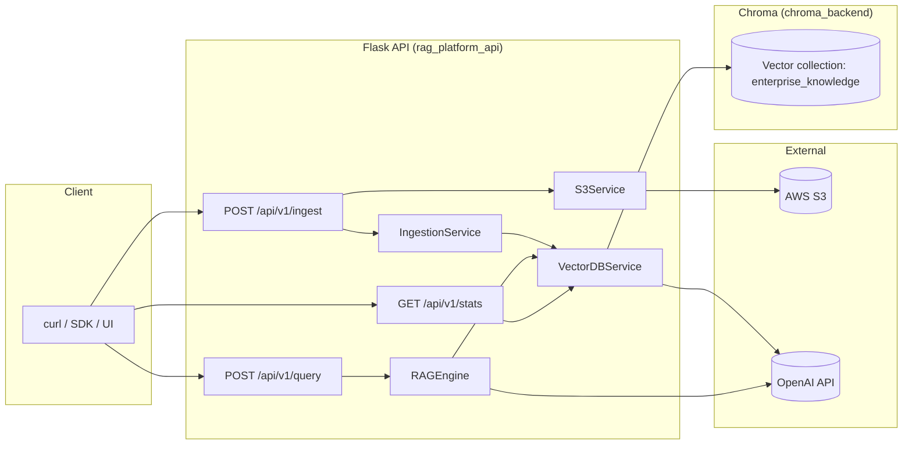
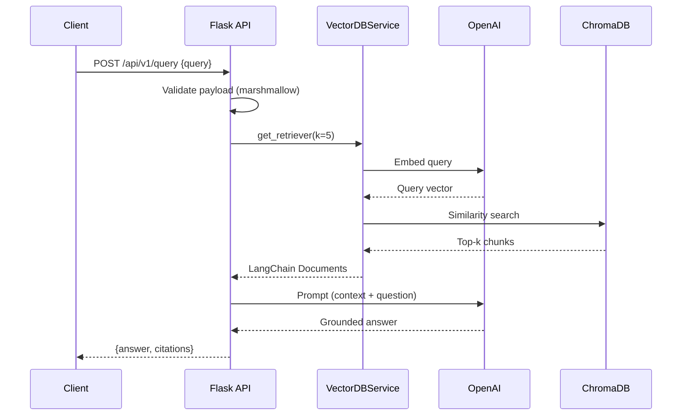

# Enterprise RAG Platform

A production-leaning Retrieval-Augmented Generation service that turns a pile
of documents sitting in S3 into a grounded, citation-backed Q&A API.

Built to explore the boring-but-important bits of RAG that are easy to skip in
a demo — input validation, deterministic chunking, clean service boundaries,
containerised vector store, non-root Docker images, offline tests, and a
lazy-initialised LLM so the app boots without an OpenAI key.

> **Stack:** Flask · LangChain · OpenAI · ChromaDB · AWS S3 · Docker Compose

---

## Table of contents

- [What it does](#what-it-does)
- [Architecture](#architecture)
- [Request flow](#request-flow)
- [Project layout](#project-layout)
- [Quickstart (Docker)](#quickstart-docker)
- [Quickstart (local Python)](#quickstart-local-python)
- [Configuration](#configuration)
- [API reference](#api-reference)
- [Testing](#testing)
- [Design notes](#design-notes)
- [Roadmap](#roadmap)

---

## What it does

1. **Ingest** a PDF / TXT / MD / CSV file straight from an S3 bucket.
2. **Chunk** it with a recursive splitter that tries to preserve paragraph
   and sentence boundaries.
3. **Embed** each chunk with OpenAI `text-embedding-3-small` and persist it
   into ChromaDB.
4. **Answer** natural-language questions by retrieving the top-k most similar
   chunks and asking `gpt-4o-mini` to answer **only** from that context,
   returning structured citations (source document + page) alongside the
   answer.

The LLM is prompted to refuse when the retrieved context doesn't cover the
question — so "I don't have enough information to answer that" is a feature,
not a bug.

---

## Architecture



Two containers. The API is stateless; all durable state lives in Chroma.

---

## Request flow

A `/query` call, end to end:



`/ingest` follows the mirror path: download from S3 → chunk → embed → upsert.

---

## Project layout

```
.
├── app/
│   ├── __init__.py          # Flask app factory (config, logging, blueprints)
│   ├── config.py            # Dev / Prod / Testing configs driven by env
│   ├── api/
│   │   ├── __init__.py      # Blueprint
│   │   ├── routes.py        # /ingest, /query, /stats
│   │   └── schemas.py       # Marshmallow request validation
│   └── services/
│       ├── s3_service.py    # Parse + download s3:// URLs
│       ├── ingestion.py     # Load + split documents
│       ├── vector_db.py     # Chroma client (HTTP or embedded)
│       └── rag_engine.py    # Prompt + retriever + LLM chain
├── tests/                   # Offline pytest suite (no network, no API key)
├── Dockerfile               # Non-root, healthcheck, gunicorn
├── docker-compose.yml       # API + Chroma server wired together
├── Makefile                 # install / test / run / up / down
├── requirements.txt
├── requirements-dev.txt
└── run.py
```

---

## Quickstart (Docker)

The recommended path — brings up the API and a standalone Chroma server.

```bash
cp .env.example .env
# add at minimum OPENAI_API_KEY (and AWS creds if your bucket is private)

docker compose up --build
```

That boots:

| Service       | Container          | Port   |
| ------------- | ------------------ | ------ |
| Flask API     | `rag_platform_api` | `5000` |
| ChromaDB      | `chroma_backend`   | `8000` |

Sanity check:

```bash
curl http://localhost:5000/health
```

---

## Quickstart (local Python)

Useful when you want to hack on the service without Docker. Omitting
`CHROMA_HOST` switches Chroma to its embedded persistent client, so no
second process is required.

```bash
python3 -m venv .venv && source .venv/bin/activate
pip install -r requirements-dev.txt

cp .env.example .env
# remove CHROMA_HOST from .env (or set it to blank) to use embedded mode
echo "OPENAI_API_KEY=sk-..." >> .env

make run      # or: python run.py
```

---

## Configuration

Everything is driven by environment variables (see `.env.example`):

| Variable                  | Default                  | Notes                                         |
| ------------------------- | ------------------------ | --------------------------------------------- |
| `OPENAI_API_KEY`          | — (required)             | Used for embeddings + chat                    |
| `OPENAI_CHAT_MODEL`       | `gpt-4o-mini`            | Any Chat Completions model                    |
| `OPENAI_EMBEDDING_MODEL`  | `text-embedding-3-small` |                                               |
| `AWS_ACCESS_KEY_ID` / `AWS_SECRET_ACCESS_KEY` | — | Only needed for private S3 buckets |
| `AWS_DEFAULT_REGION`      | `us-east-1`              |                                               |
| `CHROMA_HOST`             | *(unset)*                | If set, use HTTP client; else embedded        |
| `CHROMA_PORT`             | `8000`                   |                                               |
| `CHROMA_DB_DIR`           | `./data/chromadb`        | Embedded-mode persistence path                |
| `CHROMA_COLLECTION`       | `enterprise_knowledge`   |                                               |
| `CHUNK_SIZE`              | `1000`                   | Characters per chunk                          |
| `CHUNK_OVERLAP`           | `200`                    |                                               |
| `RETRIEVAL_K`             | `5`                      | How many chunks feed the LLM                  |
| `LOG_LEVEL`               | `INFO`                   |                                               |
| `ENVIRONMENT`             | `development`            | `development` / `production` / `testing`      |

---

## API reference

### `GET /health`

Liveness probe. Returns `{status, service, environment}`.

### `POST /api/v1/ingest`

Pull a file from S3, chunk, embed, persist.

```bash
curl -sX POST http://localhost:5000/api/v1/ingest \
  -H "Content-Type: application/json" \
  -d '{"s3_url": "s3://acme-docs/handbooks/employee_handbook.pdf"}'
```

```json
{
  "status": "success",
  "message": "Ingested 42 chunks from s3://acme-docs/handbooks/employee_handbook.pdf",
  "chunks": 42,
  "source": "s3://acme-docs/handbooks/employee_handbook.pdf"
}
```

Errors: `400` for malformed payloads or unsupported file types, `500` for
S3 / OpenAI / Chroma failures (with a `details` field).

### `POST /api/v1/query`

Ask a grounded question.

```bash
curl -sX POST http://localhost:5000/api/v1/query \
  -H "Content-Type: application/json" \
  -d '{"query": "What is the policy for remote work?"}'
```

```json
{
  "query": "What is the policy for remote work?",
  "answer": "Employees may work remotely up to three days per week with manager approval, and must maintain core hours from 10am to 3pm (Source: s3://acme-docs/handbooks/employee_handbook.pdf, Page: 14).",
  "citations": [
    {
      "source": "s3://acme-docs/handbooks/employee_handbook.pdf",
      "page": 14,
      "content_preview": "3.1 Remote Working Guidelines: Employees are eligible to work remotely for a maximum of three (3) days per standard work week..."
    }
  ]
}
```

If the retriever returns nothing, the API short-circuits and replies
`"I don't have enough information to answer that."` with an empty `citations`
array — no unnecessary LLM call, no hallucinated answer.

### `GET /api/v1/stats`

Cheap collection introspection — handy for dashboards and smoke tests.

```json
{ "collection": "enterprise_knowledge", "document_count": 312 }
```

---

## Testing

The suite is fully offline: it stubs out the retriever and the LLM, so it
runs without an OpenAI key and without Docker.

```bash
make dev       # install dev deps
make test      # -> 12 passed
```

What it covers:

- Flask app factory wires up `/health` and the `/api/v1/*` blueprint.
- Request validation rejects missing / malformed payloads.
- `IngestionService` chunks text files and carries metadata through.
- `S3Service.parse_s3_url` handles both well-formed and bad URLs.
- `RAGEngine` produces structured citations when docs are found, and
  refuses to answer when the retriever is empty.

---

## Design notes

A few intentional choices worth calling out:

- **App factory + lazy clients.** `create_app()` is the only entry point;
  `ChatOpenAI`, `OpenAIEmbeddings` and the Chroma client are instantiated
  on first use. This keeps `flask --help`, `pytest`, and import-time linting
  fast and key-free.
- **Two modes for Chroma.** One toggle (`CHROMA_HOST`) switches between an
  embedded persistent client (single-process dev) and the HTTP client
  (docker-compose). The rest of the codebase doesn't care.
- **Citations are first-class.** The retriever runs explicitly so we can
  both inject the sources into the prompt and echo them back in the
  response — callers never have to parse the LLM output to know what was
  cited.
- **Marshmallow at the edge.** Validation lives in `app/api/schemas.py`.
  Routes stay thin and the error envelope is consistent
  (`{error, fields?, details?}`).
- **No silent hallucinations.** Empty retrieval bypasses the LLM and
  returns a canned "I don't have enough information" answer. The prompt
  itself also enforces refusal for out-of-context questions.
- **Non-root container + healthcheck.** The API image runs as the `app`
  user and exposes `/health` for Docker / k8s probes. Chroma is pulled
  in via compose and gated by `service_healthy`.

---

## Roadmap

Honest TODOs I'd tackle next:

- Streaming responses over SSE for `/query`.
- Async ingestion (Celery / RQ) so large PDFs don't block the request.
- Hybrid retrieval (BM25 + dense) for better recall on rare terms.
- Per-tenant collection namespacing + simple API key auth.
- OpenTelemetry traces on the ingest / query spans.
- Evaluation harness (RAGAS-style) wired into CI.
